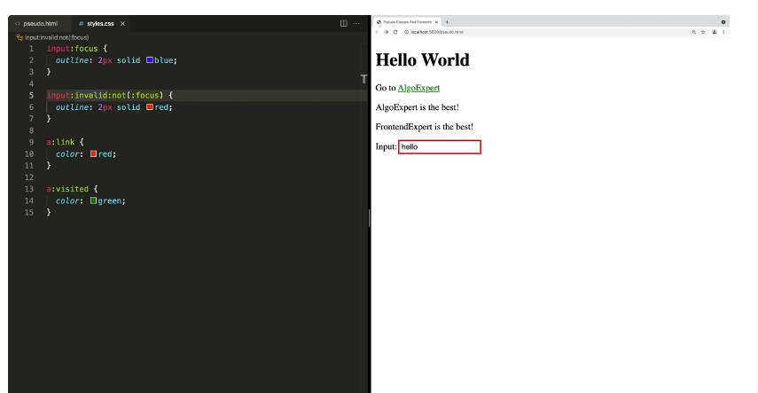
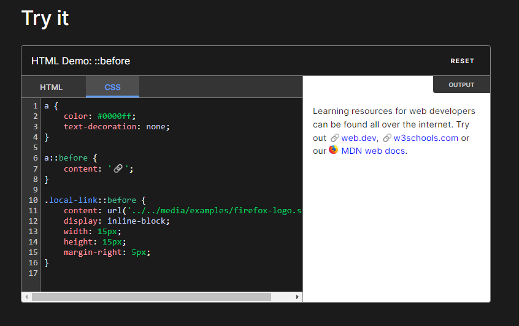

# CSS Basics

## Some Terms

### Declaration

a CSS property-value pair
```css
property: value;
```

### Declaration Block

a block containing many declarations

```css
{
    display: flex;
    color: red;
}
```

### Ruleset

A selector followed by declaration block

```css
selector {
    property: value;
    property: value;
}
```

## Selectors

```css
#id-of-some-element
.class-of-some-element
a[href="link"] /* this means select all links with value given in the bracket, this is called attribute selector */
a[href] /* this would select all elements with any href value*/
a[href*="algoexpert.io"] /*select all elements with algoexpert at any place in href*/
a[href$="algoexpert.io"] /*select all elements with algoexpert at end in href */
a[href^="algoexpert.io"] /*select all elements with algoexpert at beginning in href */

```
## Combinators
 
Use position of the dom an elements to select elements to apply css

```html
<section>
    <p> This is a paragraph inside section </p>
</section>
<footer>
    <p> This is a paragraph inside footer </p>
    <div>
        <p>This is not the direct child of footer</p>
    </div>
</footer>
```
```css
footer p {} /*this will only be applied to all <p> inside footer*/
footer > p {} /*this will only be applied to the direct children of footer*/
h2 ~ p {} /*select all <p> which are siblings of <h2>*/
h2 + p {} /*select all <p> which are adjacent siblings of <h2>*/
```

## Pseudo Classes and Elements
An addition to a css selector to select elements based on the current state. These start with ':'.
```css
button:hover {} /*select all buttons which are currently hovered over*/ 
```

An example:
In the below example, if we simply use two pseudo selectors on input without not, the user would see red border while typing because we have two pseudo selectors on input and so the second one would get applied.

We can use not condition which means "select input which is in invalid state and not in focus".



### Pseudo Elements

This applies to a specific portion of the element. These start with '::', so p::first-letter would select the first letter of paragraphs.

```css
a::before { content: '>'} /*before adds and an element before the a tag, in this case it will add the > before all a tags*/
```



## Selector Specificity

When you have conflicting styles, the most specific style will be taken. If specificity is same, the last style will be taken.

> !important : this overrides the selector specificity. You should avoid using this.