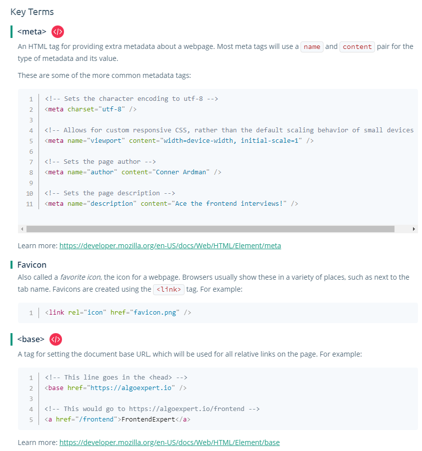

# HTML Basics

## Common Semantic Grouping Elements

- **\<article\>**: self-contained, independently distributable
- **\<section\>**: not self contained
- **\<header\>**: Introductory content
- **\<main\>**: main content, one per page. Mostly used in complex websites to help assistive technologies like screen readers.
- **\<nav\>**: section of links
- **\<side\>**: side information which can be safely removed from the web page.
- **\<footer\>**: footer of the document

## Essential Tags

It is very important to choose the semantically correct HTML tags to properly structure your HTML document.

### Images
```html

```
### Lists
```html
<!--ordered lists-->
<ol>
    <li></li>
    <li></li>
    <li></li>
</ol>

<!--unordered lsits-->
<ul>
    <li></li>
    <li></li>
    <li></li>
</ul>
```

### Preformatted Text
This tag preserves the whitespaces
```html
<pre>
    This is indented
    and has a new line
</pre>
```
### Line break
```html
<p>
    Dear John, <br/>
    How are you doing?
</p>
```
Not a replacement for CSS
This tag has semantic meaning

### Horizontal Rule
Draws horizontal line. this also has semantic meaning.
```html
<hr/>
```

### Anchor Tag
```html
<a href="https://www.google.com">Google Link</a>
```
You can add target="_blank" to open in a new browser window.

### Emphasis and String
```html
<p>I <em>need</em> to study</p>
```
Shown in italics. It has semantic meaning. Similarly for \<strong\/\>.

## Tables

An HTML tag for representing data in tabular format.

```html
<table>
    <caption>Jatin Narula products</caption>
    <thead>
        <tr>
            <th scope="col">Product</th> <!--Tells screen readers what type of heading it is.-->
            <th scope="col">Rating</th>
        </tr>
    </thead>
    <tbody>
        <tr>
            <th scope="row">Product1</th>
            <td>5</td>
        </tr>
        <tr>
            <th scope="row">Product2</th>
            <td>9</td>
        </tr>
    </tbody>
</table>
```
> Note: other tags to explore in tables: colspan, colgroup 

## Forms

An HTML tag for a section of interactive inputs, used for submitting information to the server.

## Document Object Model

What happens to HTML? HTML --> DOM
- DOM stores each HTML Element as a node in the DOM tree.
- DOM provides and API too.

## Accessibility

- Building applications usable by as many people as possible.
- When we use proper labels and semantic html, the accessibility tree contains all that we need for accessibility.

### WAI - ARIA

Web accessibility initiative - accessible rich internet applications

- Roles: What an element does
- Properties: Extra meaning (i.e. labels)
- States: current state(i.e. disabled)

## Meta Tags



